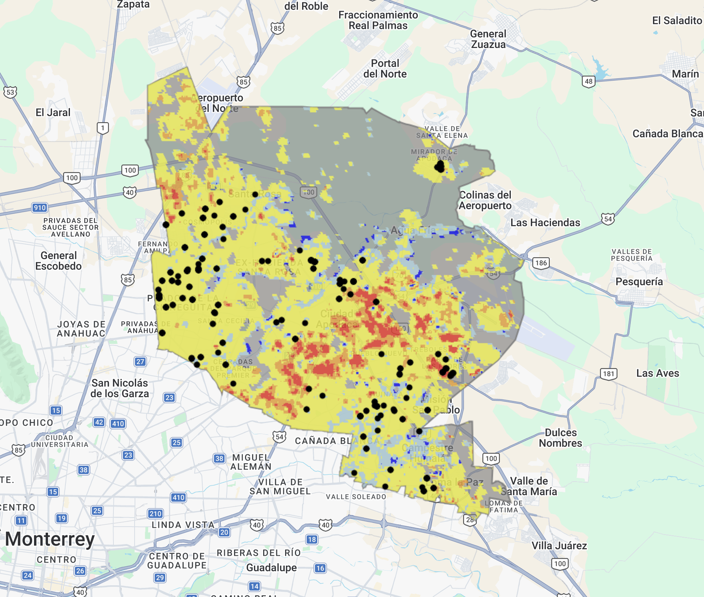

# Validación de Árboles de especies nativas o adaptadas plantados por el municipio en áreas con suelo clasificado como caliente o muy caliente

Este repositorio contiene el **script de Google Earth Engine (GEE)** necesario para validar si los árboles de especies nativas o adaptadas plantados por el municipio se encuentran en áreas con suelo clasificado como **caliente o muy caliente**, utilizado en la evaluación semestral **Alcalde, ¿Cómo Vamos?**.

---

## Estructura del repositorio

```
├── main.js
│
├── public/
│   └── ejemplo.png
│
├── README.md
```

---

## Funcionalidad

El script:

1. Carga el **raster de temperatura mensual** promediado para el municipio
2. Clasifica cada píxel de zona urbanizada en 5 rangos de temperatura basados en media y desviación estándar:

   | Clase | Rango |
   |-------|-------|
   | 0 | Muy frío (mín a media − 2σ) |
   | 1 | Frío (media − 2σ a media − σ) |
   | 2 | Normal (media − σ a media + σ) |
   | 3 | Caliente (media + σ a media + 2σ) |
   | 4 | Muy caliente (media + 2σ a máx) |

3. Importa un CSV de coordenadas de árboles plantados y les asigna la clase de temperatura correspondiente
4. Exporta los resultados como **CSV de validación** con la columna `class` que indica en qué rango de temperatura cayó cada coordenada
5. Muestra en el **mapa** la clasificación de temperatura y los puntos validados

---

## Assets necesarios

El script **requiere dos assets** previamente subidos a Google Earth Engine:

* `temp_monthly_2024_NL/temp_montly_NL_corte24-25` — ImageCollection con el raster de temperatura mensual
* `arboles_eva1/arboles_eva1_apo` — FeatureCollection con las coordenadas de los árboles a validar (cambiar según el municipio a evaluar)

El CSV de árboles debe contener las columnas:

```
municipio, periodo, ano, mes, cantidad, suelo, lat, lon
```

---

## Ejecución

### 1. Subir los assets

1. Entrar al **Code Editor**: [https://code.earthengine.google.com](https://code.earthengine.google.com)
2. En el panel izquierdo ir a **Assets**
3. Para el CSV de árboles: clic en **NEW → Table upload**, subir el archivo y guardarlo como:

```
projects/ee-comovamosnl/assets/arboles_eva1/arboles_eva1_apo
```

---

### 2. Abrir el script

1. Copiar el contenido del archivo:

```
main.js
```

2. Pegarlo en un script nuevo dentro del editor de código de GEE

3. Dentro del script, ajustar el municipio en la variable de configuración:

```js
var municipalities = ['Apodaca']; // Cambiar según el municipio a evaluar
```

---

### 3. Ejecutar ▶️

* Dar click en **Run**
* Revisar:
  * El **mapa** con la clasificación de temperatura y los puntos de árboles
  * La pestaña **Tasks** para exportar el CSV de validación

---

## Resultados

### Mapa

Se visualizan en el mapa:
- Límite municipal (gris)
- Clasificación de temperatura por píxel (azul a rojo)
- Puntos de árboles validados (negro)

### CSV de validación

Se exporta a Google Drive con el nombre `Validacion_EVA1_APO`. Contiene las columnas originales del CSV de entrada más la columna **`class`**, que indica en qué rango de temperatura cayó cada coordenada (0 = muy frío, 4 = muy caliente).

---

**Ejemplo de salida (captura)**


